# 029 基于Python爬虫的B站弹幕可视化-设计展示

> **代码有偿获取 可接受定制 微信联系方式: csbysj2020 或 ACE2487，备注(BS)**

> 

> 

## 介绍

这是一个基于Python的B站弹幕可视化项目，主要使用了python django、requests、jieba等库。该项目实现了以下功能：
    1. 爬取Bilibili视频弹幕数据：通过爬虫获取视频的标题、视频总时长、封面图，视频地址以及所有弹幕数据等。
    2. 弹幕文本清洗和分词：对抓取到的弹幕文本进行清洗和分词处理，去除停用词并生成分词列表。
    3. 弹幕发送量分析：统计视频过程中每一秒的弹幕量，并以折线图展示。
    4. 弹幕文本分词分析：对弹幕文本进行分词处理，并以词云图展示关键词。
    5. 情感分析：使用朴素贝叶斯算法对弹幕文本进行情感分析，并以饼图进行可视化。将情感分为正面和中性，并展示各自所占比例。
此外，该项目还使用了前端框架Vue.js及其相关库element-plus、axios、vue-router，具有良好的用户体验和交互效果。

## 技术栈

python django requests jieba echarts vue element-plus axios vue-router 朴素贝叶斯算法分析情感分类 爬虫抓取Bilibili视频弹幕 
弹幕文本清洗 弹幕文本分词 去除弹幕文本停用词 弹幕发送量分析并以折线图展示视频过程中每一秒的弹幕量 弹幕文本分词分析并以词云图展示关键词 
使用朴素贝叶斯算法分析弹幕情感并以饼图进行可视化 通过爬虫可以得到视频的标题、视频总时长、封面图，视频地址以及所有弹幕数据等

## 视频

> **点击查看 \>\>\> [https://www.bilibili.com/video/BV1Nz4y1a7Fo/](https://www.bilibili.com/video/BV1Nz4y1a7Fo/)**

## 截图

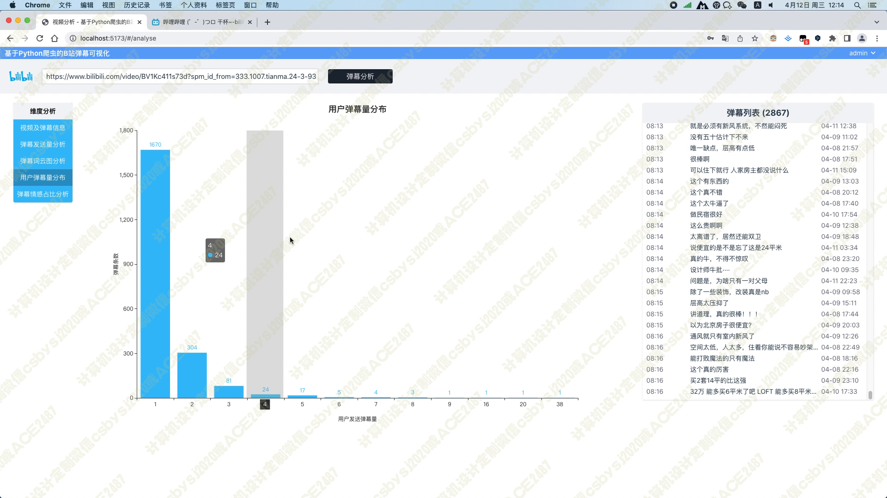
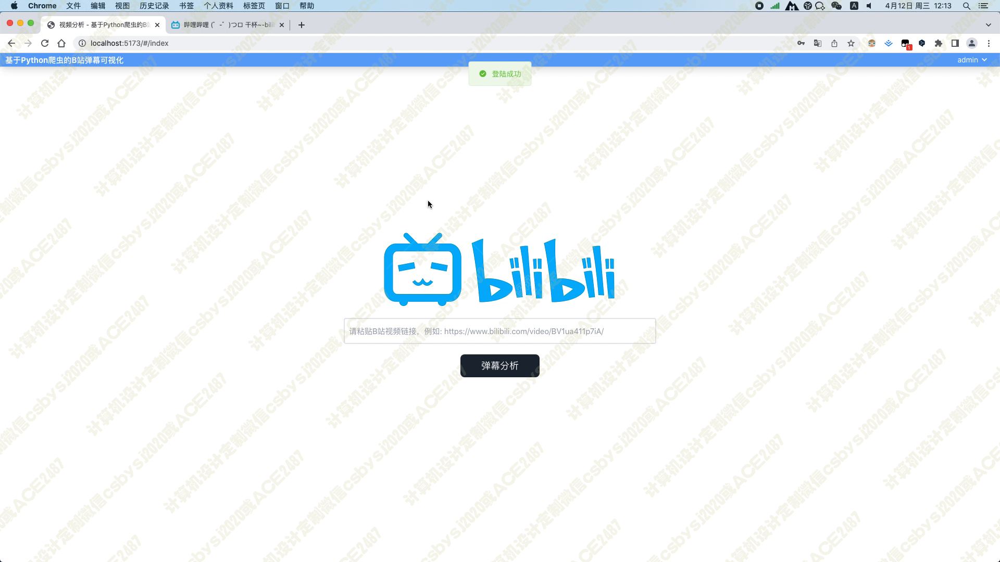
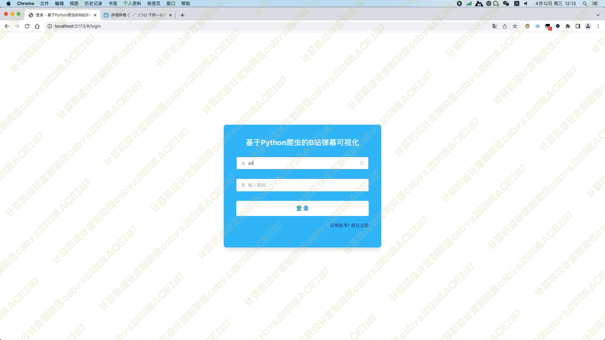
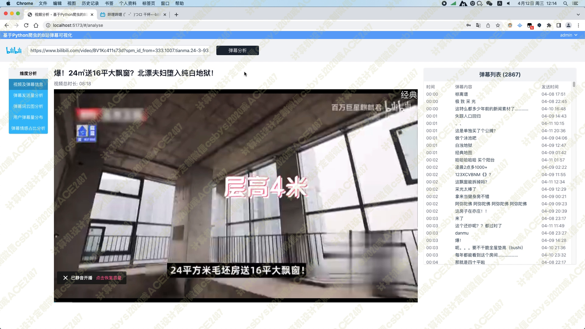
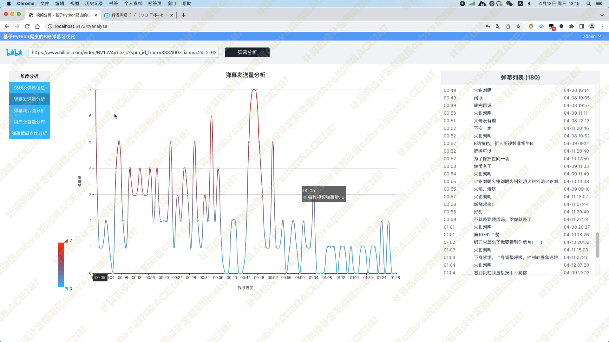
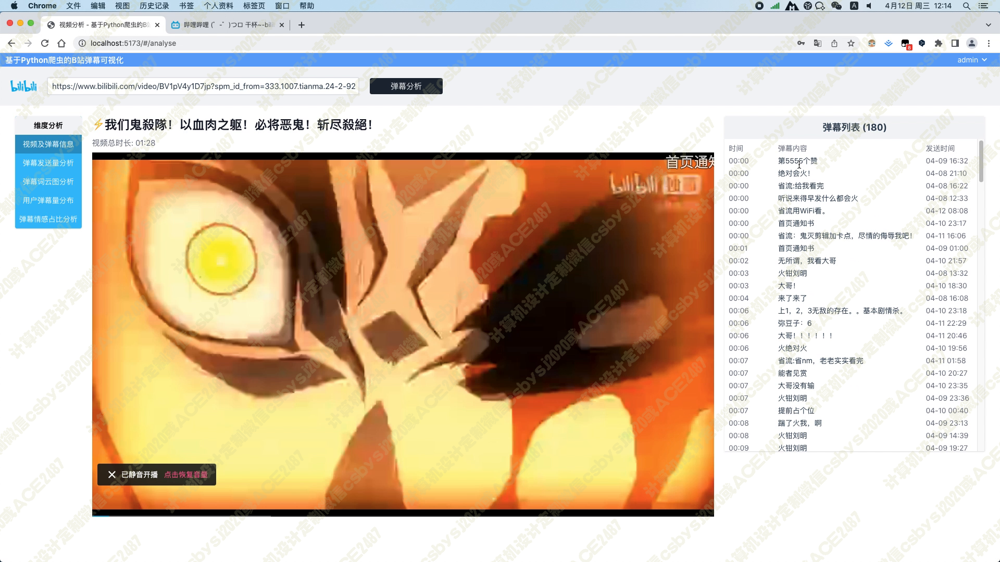
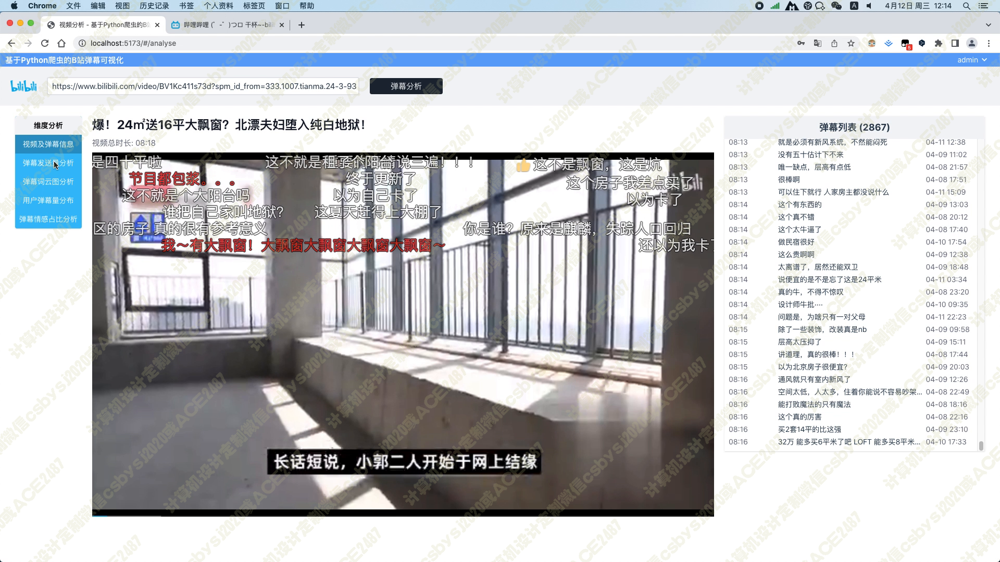
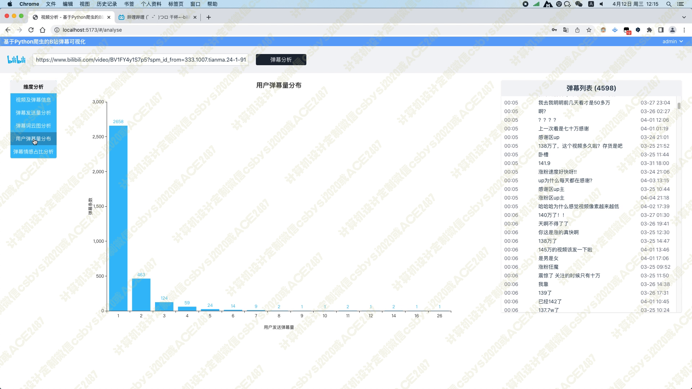
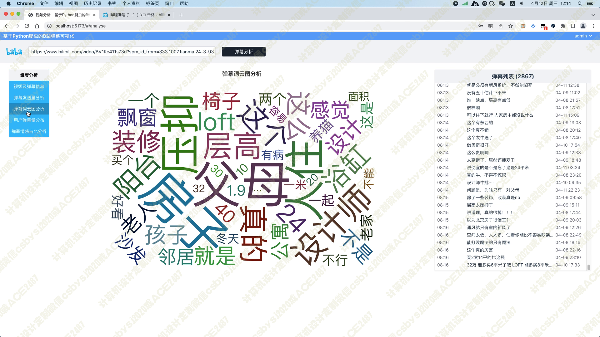
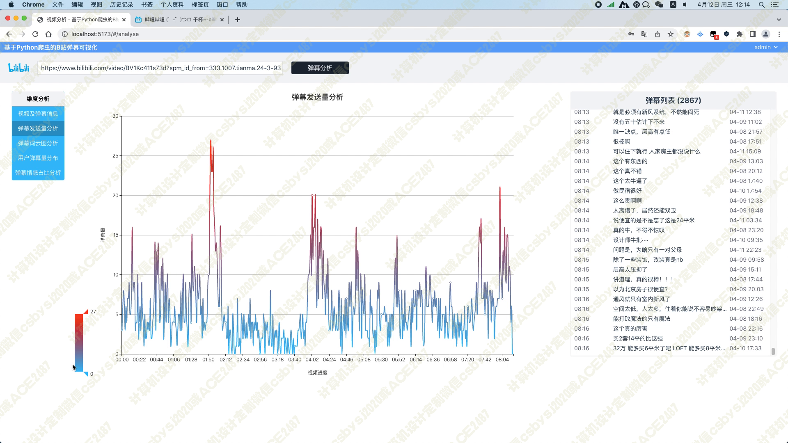
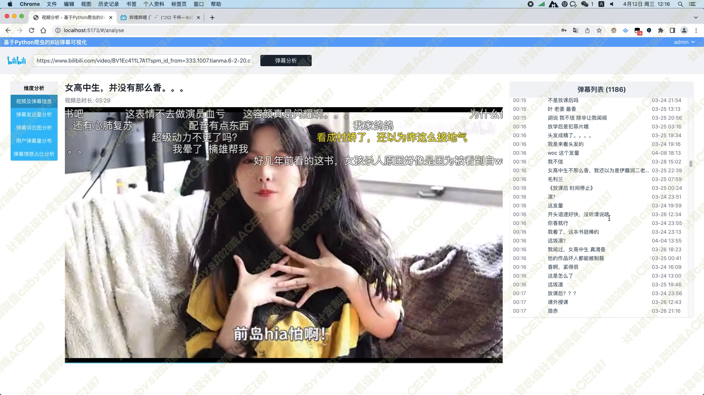
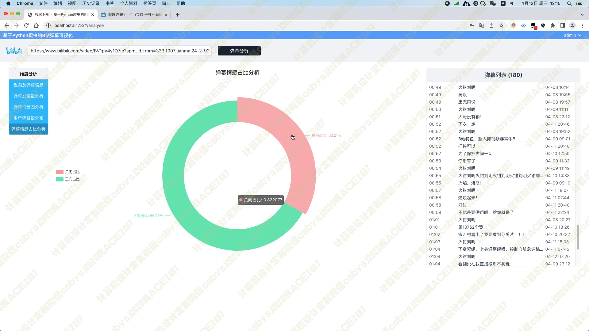
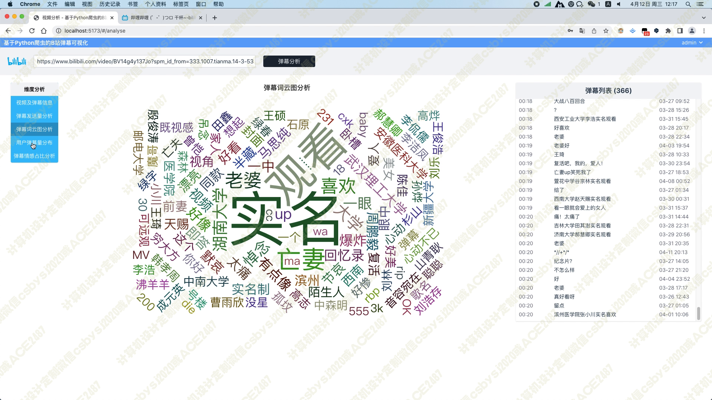
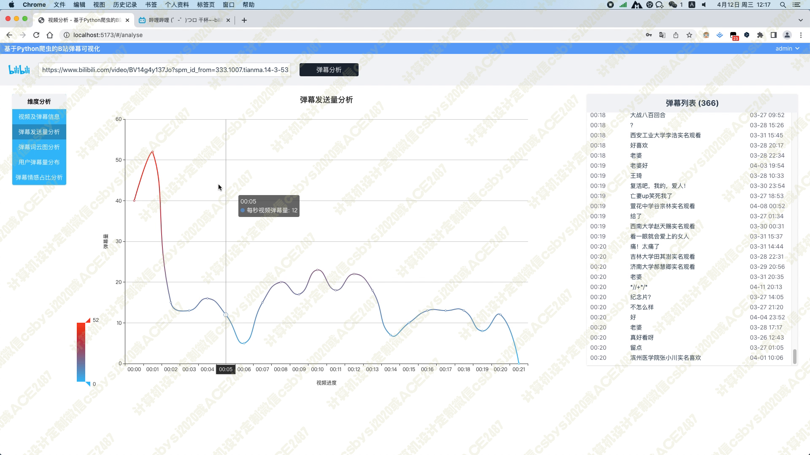
